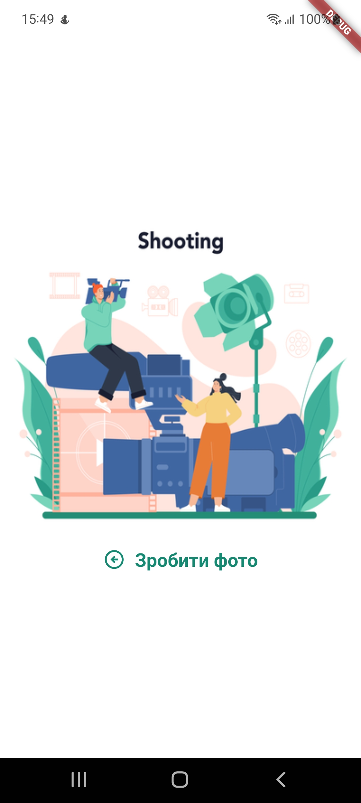
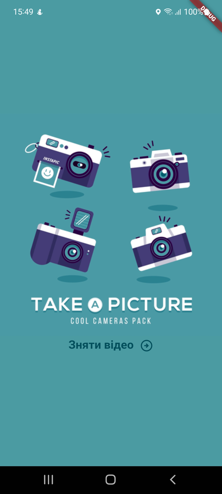

# codempire_task

Проект на flutter`і, щоб показати роботу з нативними модулями, для Codempire
.

## Огляд

### Стартова сторінка

Переключатися з фото на відео - за допомогою свайпу в ліво або в право.
Тап на зображенні, відкриває відповідну дію, після як буде отримано файл перекине на інші сторінку

## Документація

[Культура кода](/documentation/coding_convention.md)

[Налаштування firebase](/documentation/setup.md)
